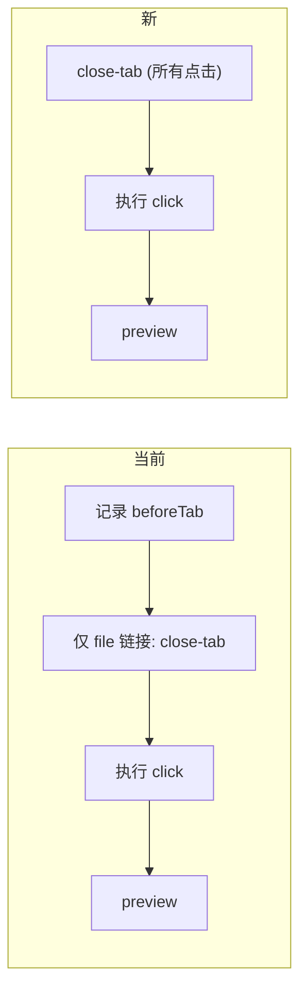

# 点击前统一关闭 Editor 标签

## 需求

每次点击 passthrough **最先**执行：后端检查 Editor 标签数量 → 如果 > 0 则发 Ctrl+W 关闭当前标签 → 如果 = 0 则跳过。之后再执行实际的 click 和 preview 逻辑。

## 当前流程 vs 新流程



## Proposed Changes

### [MODIFY] [server.js](file:///Users/evan/Documents/seafile/Seafile/00_Dev/Github/antigravity-remote-dev/server.js) — `/api/close-tab/:id`

调整阈值：**tabCount > 0 就发 Ctrl+W**，tabCount = 0 才跳过。

```diff
- if (tabCount <= 1) {
-     // skip — would close window
+ if (tabCount === 0) {
+     // no editor tabs open, nothing to close
```

> [!IMPORTANT]
> 这里有一个关键决策：**tabCount = 1 时是否关闭？**
> - 如果关闭：最后一个标签关闭后，编辑器区域变空，但**不会关闭窗口**（VS Code/Antigravity 关闭最后一个标签不等于关闭窗口）
> - 之前设 `<= 1` 是保守做法，实际 VS Code 的 Cmd+W 在只剩一个标签时只关标签不关窗口
> - 按你的需求（> 0 就关），改为 `=== 0` 即可

### [MODIFY] [index.html](file:///Users/evan/Documents/seafile/Seafile/00_Dev/Github/antigravity-remote-dev/public/index.html) — click handler

将 close-tab 调用提到**最前面**，对所有点击统一执行，不再限制为仅 file `<a>` 链接：

```diff
  try {
-     // Step 1: Record current tab (only needed for non-file elements)
-     let beforeTab = null;
-     if (!hasFileName) { ... }
-
-     // Step 1.5: If clicking a pure file <a> link, close current tab first
-     const isFileAnchor = hasFileName && clickable.tagName.toLowerCase() === 'a';
-     if (isFileAnchor) { ... close-tab ... }
+     // Step 1: 统一关闭当前 Editor 标签（后端判断 > 0 才关）
+     try {
+         await fetch(`/api/close-tab/${currentCascadeId}`, { method: 'POST' });
+         await new Promise(r => setTimeout(r, 300));
+     } catch (e) { console.warn('Pre-close tab failed:', e); }

      // Step 2: Execute the click via CDP
      ...
```

`beforeTab` 记录逻辑同步移除（不再需要 tab-change 判断，简化流程）。

## 完整新流程

| 步骤 | 动作 | 条件 |
|------|------|------|
| 1 | `POST /api/close-tab` — 后端查 tab 数量 | 所有点击 |
| 1a | tab > 0 → Cmd+W + 等 300ms | — |
| 1b | tab = 0 → 跳过 | — |
| 2 | `POST /click/:id` — 执行 CDP 点击 | 所有点击 |
| 3 | 等 500ms | — |
| 4 | `hasFileName` → 打开 preview | 文件链接 |
| 4' | 无 `hasFileName` → 不打预览 | 按钮等 |

> [!WARNING]
> 移除 tab-change 判断后，非文件点击（如某些 command 链接）即使打开了新标签也不会自动弹 preview。如果你希望保留这个能力，我可以把 tab-change 判断作为 fallback 保留。
