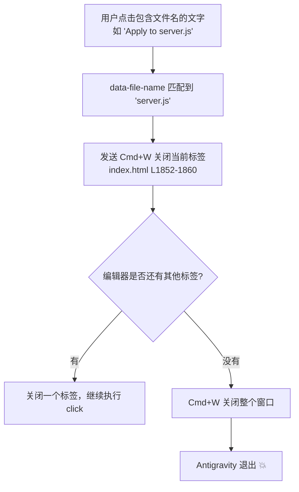

# 修复 Antigravity 点击文字导致退出的问题

## 根因分析

**确认**：此问题由之前的「点击文件链接时先关闭当前标签」功能升级导致。

### 触发链条



### 三个问题

1. **Cmd+W 太危险**（server.js L1325-1340）：通过 `Input.dispatchKeyEvent` 发送 Cmd+W 是全局的键盘事件，如果焦点不在编辑器标签上，Cmd+W 会直接关闭整个窗口
2. **文件名匹配过于激进**（server.js L498, index.html L1798）：正则 `fileExtPattern` 会匹配任何按钮/链接中包含文件扩展名的文字，如 "Apply changes to server.js" 也会被标记为 `data-file-name`
3. **没有检查是否有活动标签**：关闭前不检查是否有编辑器标签打开，直接执行 Cmd+W

### 涉及代码

| 位置 | 行号 | 作用 |
|------|------|------|
| [index.html](file:///Users/evan/Documents/seafile/Seafile/00_Dev/Github/antigravity-remote-dev/public/index.html#L1852-L1860) | L1852-1860 | 前端：点击前发送 close-tab 请求 |
| [server.js](file:///Users/evan/Documents/seafile/Seafile/00_Dev/Github/antigravity-remote-dev/server.js#L1318-L1348) | L1318-1348 | `/api/close-tab/:id`：通过 Cmd+W 关闭标签 |
| [server.js](file:///Users/evan/Documents/seafile/Seafile/00_Dev/Github/antigravity-remote-dev/server.js#L498) | L498 | `captureHTML` 中的 fileExtPattern 正则 |
| [index.html](file:///Users/evan/Documents/seafile/Seafile/00_Dev/Github/antigravity-remote-dev/public/index.html#L1798) | L1798 | 前端也有同样的正则补充检测 |

## Proposed Changes

### [MODIFY] [server.js](file:///Users/evan/Documents/seafile/Seafile/00_Dev/Github/antigravity-remote-dev/server.js)

替换 `/api/close-tab/:id` 的实现：

```diff
- // Use CDP Input.dispatchKeyEvent to send Ctrl/Cmd+W
- const modifier = process.platform === 'darwin' ? 4 : 2;
- await c.cdp.call('Input.dispatchKeyEvent', { ... Cmd+W ... });
+ // Use VS Code command API to close ONLY the active editor (not the window)
+ await c.cdp.call('Runtime.evaluate', {
+     expression: `(() => {
+         // Check if there's an active editor tab first
+         const tab = document.querySelector('.tab.active.selected');
+         if (!tab) return { ok: false, reason: 'no active tab' };
+         // Use the VS Code keybinding command via command palette
+         // This is safer than Cmd+W which can close the window
+         const api = window.acquireVsCodeApi?.() || globalThis.vscode;
+         if (api) {
+             api.postMessage({ type: 'command', command: 'workbench.action.closeActiveEditor' });
+             return { ok: true, method: 'command' };
+         }
+         return { ok: false, reason: 'no api' };
+     })()`,
+     returnByValue: true,
+     contextId: ctx.id
+ });
```

> [!IMPORTANT]
> 如果 VS Code API 不可用，回退方案是先检查打开的标签数量：如果只剩一个标签，则**跳过关闭**而非冒险发送 Cmd+W。

### [MODIFY] [index.html](file:///Users/evan/Documents/seafile/Seafile/00_Dev/Github/antigravity-remote-dev/public/index.html)

在前端增加安全检查：只有当点击的目标**确实是纯文件链接**（而非包含文件名文字的按钮）时才发送 close-tab。

## Verification Plan

1. 启动 Antigravity，**不打开任何文件**（只有聊天面板）
2. 在 Web UI 点击包含文件名的文字 → 确认 Antigravity **不会退出**
3. 打开一个文件，再点击另一个文件链接 → 确认旧标签关闭、新文件打开
