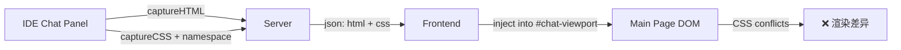
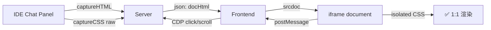

# iframe CSS 隔离：实现网页端与 Antigravity Chat 显示一致

## 问题背景

当前方案通过 `captureCSS()` 提取 IDE 的所有 CSS 规则并做 **namespace 替换**（`body → #chat-viewport`），然后将克隆的 HTML 注入主页面的 `#chat-viewport` 容器。这种方式存在以下问题：

1. **CSS 冲突** — 主页面的 `* { margin:0; padding:0 }` 全局 reset 会影响 IDE 内容
2. **Tailwind 类与 namespace 不匹配** — selector 替换（`:root → #chat-viewport`）不完美，导致部分 Tailwind utility 失效
3. **CSS 变量作用域错位** — IDE 变量挂在 `:root`/`body`，替换后可能断链
4. **大量 `!important` 修补** — 当前有 ~60 行手写修补规则（overflow、prose、code 等）

> [!IMPORTANT]
> 本次重构的核心目标：**用 iframe 做 CSS 隔离**，让 IDE 的 CSS 在独立 document 中原样生效，无需任何 namespace 替换和修补。

---

## Proposed Changes

### Server 端

#### [MODIFY] [server.js](file:///Users/evan/Documents/seafile/Seafile/00_Dev/Github/antigravity-remote-dev/server.js)

**1. 修改 `captureCSS()` — 停止 namespace 替换**

```diff
- function namespaceRule(text) {
-     text = text.replace(/(^|[\s,}])body(?=[\s,{:.])/gi, '$1#chat-viewport');
-     text = text.replace(/(^|[\s,}])html(?=[\s,{:.])/gi, '$1#chat-viewport');
-     text = text.replace(/(^|[\s,}]):root(?=[\s,{])/gi, '$1#chat-viewport');
-     text = text.replace(/(^|[\s,}]):host(?=[\s,{(])/gi, '$1#chat-viewport');
-     return text;
- }
+ // No namespace replacement needed — CSS will run in an isolated iframe document
+ function namespaceRule(text) { return text; }
```

**2. 新增 `/snapshot-doc/:id` 端点** — 返回完整 HTML document 字符串

组装逻辑：
- `<head>` 内放完整 CSS（`captureCSS` 原样结果） + CSS 变量声明（`captureComputedVars` 结果写入 `:root {}`）
- `<body>` 使用捕获的 `bodyBg` / `bodyColor` 设置 `style` 属性
- `<body>` 内容是 `captureHTML` 的 `clone.outerHTML`
- `<body>` 末尾注入 **bridge script**，负责：
  - 监听 `[data-cdp-click]` 的 click 事件，`postMessage` 给 parent
  - 监听 scroll 事件，`postMessage` 给 parent
  - 添加少量必要样式修补（overflow visible 等）

**3. 修改 `/snapshot/:id`** — 增加 `docHtml` 字段

在原有 `html`、`bodyBg`、`clickMap` 等字段基础上，追加 `docHtml` 字段，值为完整 HTML document。前端可优先使用 `docHtml`，回退到 `html`。

---

### Frontend 前端

#### [MODIFY] [index.html](file:///Users/evan/Documents/seafile/Seafile/00_Dev/Github/antigravity-remote-dev/public/index.html)

**1. HTML 结构变化**

```diff
  <div class="chat-container" id="chatContainer">
      <div class="scroll-loading-indicator" id="scrollLoadingIndicator">⏳ 加载历史内容...</div>
-     <div class="chat-content" id="chatContent">
-         <div class="loading">Waiting for connection...</div>
-     </div>
+     <div class="chat-content" id="chatContent">
+         <div class="loading">Waiting for connection...</div>
+     </div>
+     <iframe id="chatIframe" style="display:none;width:100%;height:100%;border:none;" sandbox="allow-same-origin allow-scripts"></iframe>
  </div>
```

**2. 改造 `updateContentOnly()`**

```js
async function updateContentOnly(id) {
    const res = await fetch(`/snapshot/${id}`);
    const data = await res.json();
    
    if (data.docHtml) {
        // 使用 iframe 隔离方案
        const iframe = document.getElementById('chatIframe');
        const chatContent = document.getElementById('chatContent');
        chatContent.style.display = 'none';
        iframe.style.display = 'block';
        iframe.srcdoc = data.docHtml;
    } else {
        // 回退到旧方案
        // ... existing logic
    }
}
```

**3. 改造 `applyCascadeStyles()`**

CSS 不再注入 `<style id="cascade-style">`（该 style 标签内容清空）。所有 IDE CSS 都已打包在 iframe 的 `docHtml` 中。

```js
async function applyCascadeStyles(id) {
    // 仅保留 body 背景色同步，CSS 已在 iframe 内自包含
    const styleRes = await fetch(`/styles/${id}`);
    if (styleRes.ok) {
        const styleData = await styleRes.json();
        const vars = styleData.computedVars || {};
        const editorBg = vars['--vscode-editor-background'] || '#1e1e1e';
        document.body.style.backgroundColor = editorBg;
    }
}
```

**4. 点击穿透 — postMessage 协议**

iframe 内 bridge script 监听点击：
```js
// 注入到 iframe 内的 bridge script
document.addEventListener('click', (e) => {
    const clickable = e.target.closest('[data-cdp-click]');
    if (!clickable) return;
    e.preventDefault();
    window.parent.postMessage({
        type: 'cdp-click',
        index: parseInt(clickable.getAttribute('data-cdp-click')),
        hasFileName: clickable.hasAttribute('data-file-name')
    }, '*');
});
```

主页面监听 postMessage：
```js
window.addEventListener('message', async (e) => {
    if (e.data.type === 'cdp-click') {
        // 复用现有 click passthrough 逻辑
        handleCdpClick(e.data.index, e.data.hasFileName);
    }
    if (e.data.type === 'scroll-sync') {
        handleScrollSync(e.data.ratio);
    }
});
```

**5. 滚动同步 — postMessage 协议**

iframe 内 bridge script 监听滚动：
```js
// 注入到 iframe 内的 bridge script
let scrollTimer = null;
document.addEventListener('scroll', () => {
    if (scrollTimer) clearTimeout(scrollTimer);
    scrollTimer = setTimeout(() => {
        const maxScroll = document.documentElement.scrollHeight - window.innerHeight;
        if (maxScroll <= 0) return;
        const ratio = window.scrollY / maxScroll;
        window.parent.postMessage({ type: 'scroll-sync', ratio }, '*');
    }, 300);
}, true);
```

**6. 清理不再需要的代码**

- 删除 `<style id="cascade-style">` 中的 ~100 行 namespace CSS 修补
- 删除 `chatContent.addEventListener('click', ...)` 中直接绑定的点击事件
- 删除 `chatContainer.addEventListener('scroll', ...)` 中直接绑定的滚动事件
- 这些逻辑全部迁移到 postMessage handler

---

## 数据流对比

### Before (当前)



### After (iframe 隔离)



---

## Verification Plan

### Manual Verification

由于本项目没有自动化测试框架，验证需通过人工对比进行：

1. **启动本地服务**
   ```bash
   cd /Users/evan/Documents/seafile/Seafile/00_Dev/Github/antigravity-remote-dev
   node server.js
   ```

2. **打开 Antigravity IDE**，确保有一个活跃的 chat 对话

3. **在浏览器中打开 web 端** `http://localhost:3563`

4. **逐项验证**：

   | 检查项 | 验证方法 |
   |--------|----------|
   | 文字颜色 | 对比 AI 回复的文字颜色是否一致 |
   | 代码块样式 | 对比代码高亮、背景色、圆角 |
   | 按钮样式 | 对比 Accept/Reject 按钮背景色、文字色 |
   | 链接颜色 | 对比可点击链接的颜色 |
   | prose 排版 | 对比 markdown 标题、列表、blockquote 样式 |
   | 滚动同步 | 在 web 端滚动，确认 IDE 端跟随 |
   | 点击穿透 | 点击按钮，确认 IDE 端执行了操作 |
   | 文件预览 | 点击文件链接，确认弹出预览 |
   | 发送消息 | 在输入框输入消息并发送，确认 IDE 端收到 |
