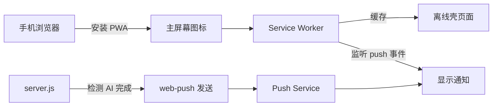

# PWA 可安装 + Push 通知 实现方案

为 Shit-Chat 添加 PWA 支持（一键安装到手机主屏）和 Web Push 通知（AI 回复完毕时推送提醒）。

## 架构总览



## Proposed Changes

### Part 1: PWA 可安装

---

#### [NEW] [manifest.json](file:///Users/evan/Documents/seafile/Seafile/00_Dev/Github/Antigravity-Shit-Chat/public/manifest.json)

Web App Manifest 文件，定义应用名称、图标、主题色、启动方式：

```json
{
  "name": "Antigravity Shit-Chat",
  "short_name": "Shit-Chat",
  "description": "Monitor & interact with Antigravity AI chat sessions",
  "start_url": "/",
  "display": "standalone",
  "background_color": "#0d0d0d",
  "theme_color": "#3b82f6",
  "orientation": "portrait-primary",
  "icons": [
    { "src": "/icons/icon-192.png", "sizes": "192x192", "type": "image/png" },
    { "src": "/icons/icon-512.png", "sizes": "512x512", "type": "image/png" }
  ]
}
```

#### [NEW] [icons/](file:///Users/evan/Documents/seafile/Seafile/00_Dev/Github/Antigravity-Shit-Chat/public/icons/)

使用 `generate_image` 生成 192x192 和 512x512 的 App 图标。🚀 火箭元素 + 深色背景。

---

#### [NEW] [sw.js](file:///Users/evan/Documents/seafile/Seafile/00_Dev/Github/Antigravity-Shit-Chat/public/sw.js)

Service Worker 负责两件事：
1. **缓存静态资源** — 离线时显示壳页面
2. **监听 push 事件** — 收到推送时显示通知

```javascript
const CACHE_NAME = 'shitchat-v1';
const STATIC_ASSETS = ['/', '/index.html', '/login.html', '/manifest.json'];

// Install: 预缓存静态资源
self.addEventListener('install', (e) => {
  e.waitUntil(
    caches.open(CACHE_NAME)
      .then(cache => cache.addAll(STATIC_ASSETS))
  );
  self.skipWaiting();
});

// Activate: 清理旧缓存
self.addEventListener('activate', (e) => {
  e.waitUntil(
    caches.keys().then(keys =>
      Promise.all(keys.filter(k => k !== CACHE_NAME).map(k => caches.delete(k)))
    )
  );
  self.clients.claim();
});

// Fetch: Network-first，离线回退到缓存
self.addEventListener('fetch', (e) => {
  if (e.request.method !== 'GET') return;
  e.respondWith(
    fetch(e.request).catch(() => caches.match(e.request))
  );
});

// Push: 显示通知
self.addEventListener('push', (e) => {
  const data = e.data?.json() || {};
  e.waitUntil(
    self.registration.showNotification(data.title || '💬 Shit-Chat', {
      body: data.body || 'AI has finished responding',
      icon: '/icons/icon-192.png',
      badge: '/icons/icon-192.png',
      tag: data.cascadeId || 'default',   // 同 cascade 合并通知
      data: { url: '/', cascadeId: data.cascadeId }
    })
  );
});

// 点击通知 → 打开/聚焦应用
self.addEventListener('notificationclick', (e) => {
  e.notification.close();
  e.waitUntil(
    clients.matchAll({ type: 'window' }).then(list => {
      for (const c of list) {
        if (c.url.includes(location.origin)) { c.focus(); return; }
      }
      return clients.openWindow(e.notification.data?.url || '/');
    })
  );
});
```

---

#### [MODIFY] [index.html](file:///Users/evan/Documents/seafile/Seafile/00_Dev/Github/Antigravity-Shit-Chat/public/index.html)

在 `<head>` 中添加 manifest 链接和 meta 标签：

```diff
+ <link rel="manifest" href="/manifest.json">
+ <meta name="theme-color" content="#3b82f6">
+ <meta name="apple-mobile-web-app-capable" content="yes">
+ <meta name="apple-mobile-web-app-status-bar-style" content="black-translucent">
+ <link rel="apple-touch-icon" href="/icons/icon-192.png">
```

在 `<script>` 末尾注册 Service Worker：

```javascript
// Register Service Worker
if ('serviceWorker' in navigator) {
  navigator.serviceWorker.register('/sw.js');
}
```

#### [MODIFY] [login.html](file:///Users/evan/Documents/seafile/Seafile/00_Dev/Github/Antigravity-Shit-Chat/public/login.html)

同样添加 manifest 链接（PWA 安装需要所有页面一致）。

---

### Part 2: Web Push 通知

---

#### [MODIFY] [package.json](file:///Users/evan/Documents/seafile/Seafile/00_Dev/Github/Antigravity-Shit-Chat/package.json)

添加 `web-push` 依赖：

```diff
  "dependencies": {
      "ws": "^8.18.0",
-     "express": "^4.18.2"
+     "express": "^4.18.2",
+     "web-push": "^3.6.7"
  }
```

---

#### [MODIFY] [server.js](file:///Users/evan/Documents/seafile/Seafile/00_Dev/Github/Antigravity-Shit-Chat/server.js)

**变更 1：导入 web-push + VAPID 配置**

```javascript
import webpush from 'web-push';

// VAPID keys — 首次运行自动生成并写入 config
let vapidKeys = userConfig.vapidKeys;
if (!vapidKeys) {
  vapidKeys = webpush.generateVAPIDKeys();
  // 自动写入 config.json（可选）
  userConfig.vapidKeys = vapidKeys;
  writeFileSync(configPath, JSON.stringify(userConfig, null, 4));
  console.log('🔑 Generated new VAPID keys');
}

webpush.setVapidDetails(
  'mailto:admin@shitchat.local',
  vapidKeys.publicKey,
  vapidKeys.privateKey
);

// Push subscriptions store (内存 + 文件持久化)
const SUBS_PATH = join(__dirname, '.push-subscriptions.json');
let pushSubscriptions = [];
if (existsSync(SUBS_PATH)) {
  try { pushSubscriptions = JSON.parse(readFileSync(SUBS_PATH, 'utf-8')); } catch (e) {}
}
function saveSubs() { writeFileSync(SUBS_PATH, JSON.stringify(pushSubscriptions)); }
```

**变更 2：添加 3 个 API 路由**

```javascript
// GET /api/push/vapid-key — 前端获取公钥
app.get('/api/push/vapid-key', (req, res) => {
  res.json({ publicKey: vapidKeys.publicKey });
});

// POST /api/push/subscribe — 注册推送订阅
app.post('/api/push/subscribe', (req, res) => {
  const sub = req.body;
  if (!sub?.endpoint) return res.status(400).json({ error: 'Invalid subscription' });
  // 去重
  if (!pushSubscriptions.find(s => s.endpoint === sub.endpoint)) {
    pushSubscriptions.push(sub);
    saveSubs();
  }
  res.json({ success: true });
});

// POST /api/push/unsubscribe — 取消订阅
app.post('/api/push/unsubscribe', (req, res) => {
  const { endpoint } = req.body;
  pushSubscriptions = pushSubscriptions.filter(s => s.endpoint !== endpoint);
  saveSubs();
  res.json({ success: true });
});
```

**变更 3：AI 完成检测 + 推送逻辑**

在 cascade 对象中添加状态追踪字段：

```javascript
// 在 cascade 对象定义中添加
stableCount: 0,      // 连续无变化次数
notified: false       // 已发过通知（避免重复）
```

在 `updateSnapshots()` 中检测 AI 回复完成：

```javascript
// 在 snapshot hash 比较后
if (hash !== c.snapshotHash) {
  // 内容变了 → 重置计数
  c.stableCount = 0;
  c.notified = false;
  // ... existing code ...
} else {
  // 内容没变 → 递增稳定计数
  c.stableCount = (c.stableCount || 0) + 1;
}

// 连续 3 次无变化（约 9 秒）且之前有过变化 → AI 可能已完成
if (c.stableCount === 3 && !c.notified && c.snapshot) {
  c.notified = true;
  sendPushNotification(c);
}
```

推送发送函数：

```javascript
async function sendPushNotification(cascade) {
  const payload = JSON.stringify({
    title: `💬 ${cascade.metadata.chatTitle}`,
    body: 'AI has finished responding',
    cascadeId: cascade.id
  });

  const results = await Promise.allSettled(
    pushSubscriptions.map(sub => webpush.sendNotification(sub, payload))
  );

  // 清理失效的订阅
  const failed = [];
  results.forEach((r, i) => {
    if (r.status === 'rejected' && r.reason?.statusCode === 410) {
      failed.push(pushSubscriptions[i].endpoint);
    }
  });
  if (failed.length) {
    pushSubscriptions = pushSubscriptions.filter(s => !failed.includes(s.endpoint));
    saveSubs();
  }
}
```

---

#### [MODIFY] [index.html](file:///Users/evan/Documents/seafile/Seafile/00_Dev/Github/Antigravity-Shit-Chat/public/index.html)

添加通知权限请求按钮和订阅逻辑：

**UI：** 在 header 右侧添加🔔按钮

```html
<div class="notif-btn" id="notifBtn" title="Enable notifications" onclick="toggleNotifications()">🔕</div>
```

**JS：** 推送订阅逻辑

```javascript
async function toggleNotifications() {
  const btn = document.getElementById('notifBtn');
  
  if (Notification.permission === 'default') {
    const perm = await Notification.requestPermission();
    if (perm !== 'granted') return;
  }
  
  if (Notification.permission !== 'granted') return;
  
  const reg = await navigator.serviceWorker.ready;
  const existing = await reg.pushManager.getSubscription();
  
  if (existing) {
    // 已订阅 → 取消
    await existing.unsubscribe();
    await fetch('/api/push/unsubscribe', {
      method: 'POST',
      headers: { 'Content-Type': 'application/json' },
      body: JSON.stringify({ endpoint: existing.endpoint })
    });
    btn.textContent = '🔕';
  } else {
    // 未订阅 → 订阅
    const res = await fetch('/api/push/vapid-key');
    const { publicKey } = await res.json();
    
    const sub = await reg.pushManager.subscribe({
      userVisibleOnly: true,
      applicationServerKey: urlBase64ToUint8Array(publicKey)
    });
    
    await fetch('/api/push/subscribe', {
      method: 'POST',
      headers: { 'Content-Type': 'application/json' },
      body: JSON.stringify(sub.toJSON())
    });
    btn.textContent = '🔔';
  }
}

// 页面加载时检查订阅状态
async function checkNotifStatus() {
  if (!('serviceWorker' in navigator) || !('PushManager' in window)) return;
  const reg = await navigator.serviceWorker.ready;
  const sub = await reg.pushManager.getSubscription();
  document.getElementById('notifBtn').textContent = sub ? '🔔' : '🔕';
}

function urlBase64ToUint8Array(base64String) {
  const padding = '='.repeat((4 - base64String.length % 4) % 4);
  const base64 = (base64String + padding).replace(/-/g, '+').replace(/_/g, '/');
  const raw = atob(base64);
  return Uint8Array.from([...raw].map(c => c.charCodeAt(0)));
}
```

---

#### [MODIFY] [config.example.json](file:///Users/evan/Documents/seafile/Seafile/00_Dev/Github/Antigravity-Shit-Chat/config.example.json)

添加 VAPID keys 注释说明（首次运行自动生成）：

```json
{
    "password": "shitchat",
    "port": 3563,
    "antigravityPath": "",
    "cdpPorts": [9000, 9001, 9002, 9003],
    "vapidKeys": null
}
```

## User Review Required

> [!IMPORTANT]
> **Push 通知需要 HTTPS 环境**。通过 Cloudflare Tunnel 或 `localhost` 访问时 Push 可以工作。如果通过局域网 IP（`http://192.168.x.x`）访问，Push 通知将不可用（浏览器安全限制），但 PWA 安装仍然可以。

> [!NOTE]
> VAPID 密钥首次启动时自动生成并写入 `config.json`。无需手动配置。

## Verification Plan

### Automated Tests
1. `npm install` 安装 `web-push` 依赖
2. `npm start` 启动服务
3. 无报错日志，VAPID keys 自动生成

### Manual Verification
1. **PWA 安装**：手机 Safari/Chrome 访问 → 出现"添加到主屏幕"提示 → 点击安装 → 从主屏幕图标打开，全屏显示无浏览器 UI
2. **Push 通知**：点击🔔按钮 → 授权 → 切到后台 → AI 完成回复后收到系统通知 → 点击通知跳回应用

### 文件变更汇总

| 文件 | 操作 | 说明 |
|------|------|------|
| `public/manifest.json` | 新增 | PWA 清单 |
| `public/sw.js` | 新增 | Service Worker |
| `public/icons/icon-192.png` | 新增 | App 图标 |
| `public/icons/icon-512.png` | 新增 | App 图标 |
| `public/index.html` | 修改 | manifest 链接 + SW 注册 + 通知 UI |
| `public/login.html` | 修改 | manifest 链接 |
| `server.js` | 修改 | web-push + VAPID + 订阅 API + AI 完成检测 |
| `package.json` | 修改 | 添加 web-push 依赖 |
| `config.example.json` | 修改 | 添加 vapidKeys 字段 |
